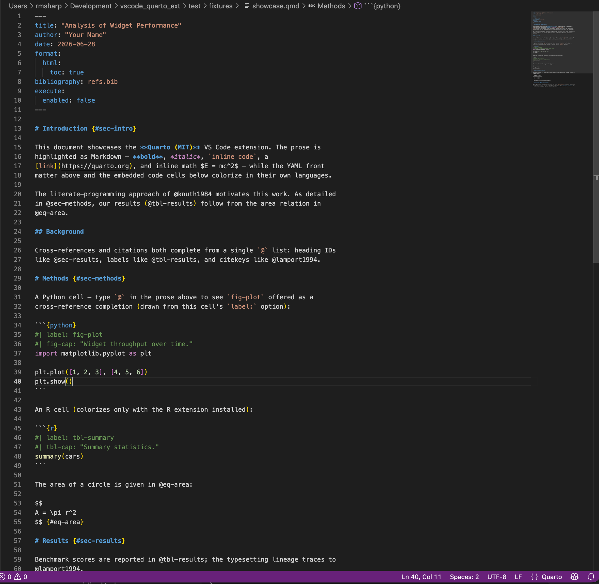
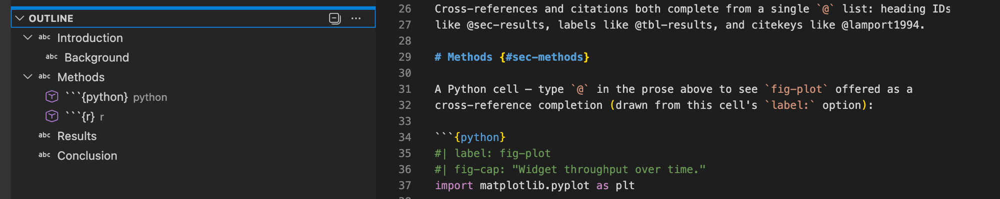
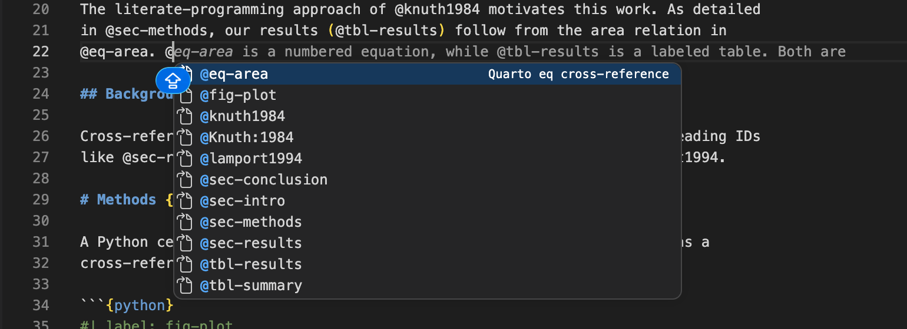
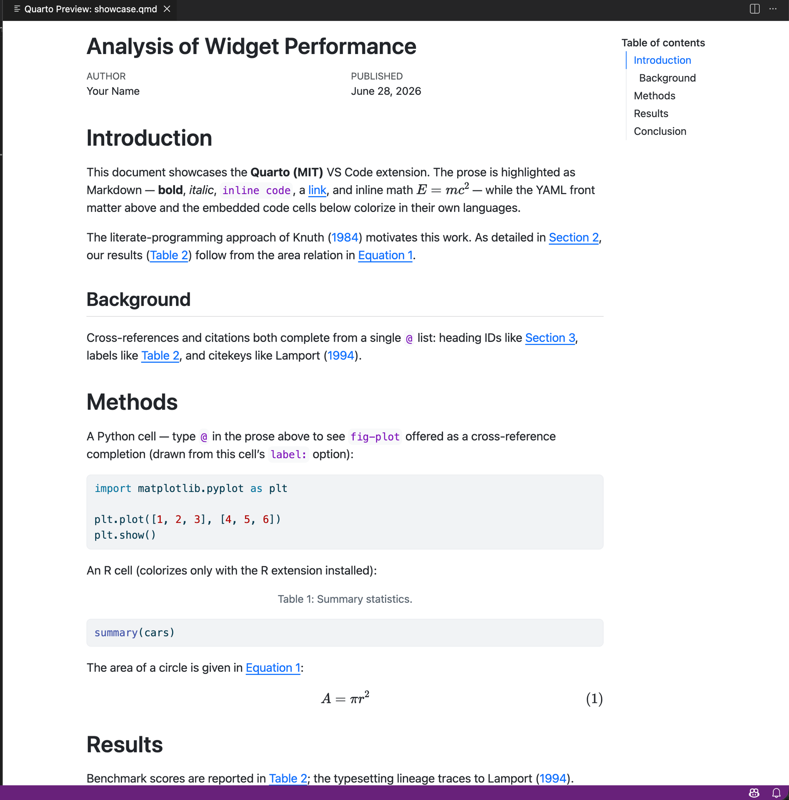
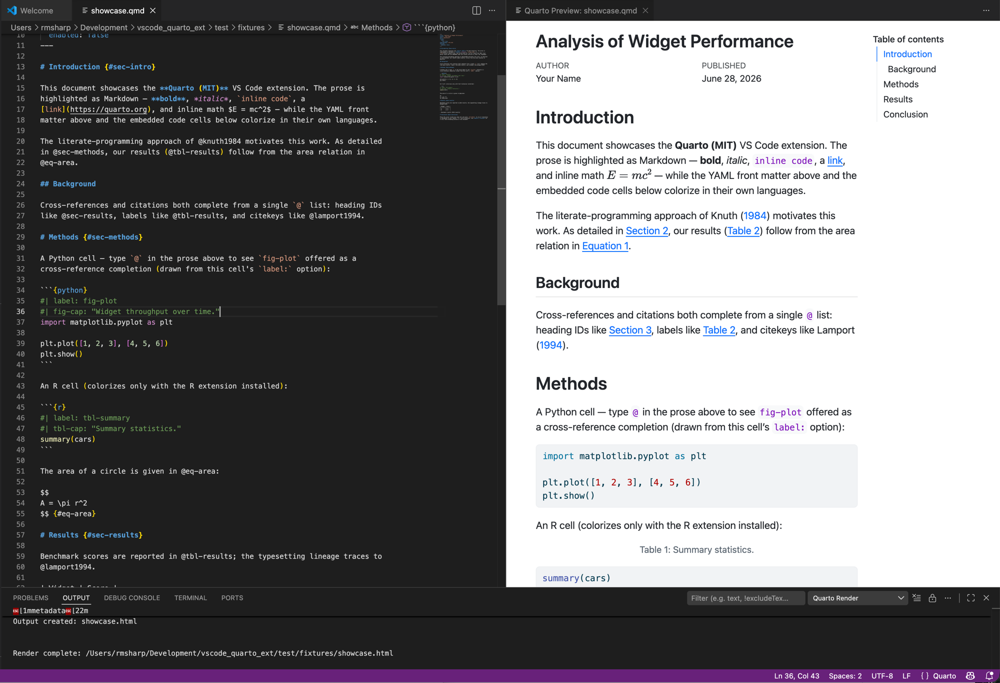

# Quarto (MIT)

An MIT-licensed VS Code extension for authoring [Quarto](https://quarto.org)
documents — syntax highlighting, render, live preview, delegated code-cell
execution, document outline, and cross-reference & citation completion.

## About this extension

Quarto (MIT) is an independent reimplementation, under the MIT License, of much
of the authoring experience offered by Posit's official Quarto extension for
VS Code. It is built on MIT-licensed upstreams and shells out to the
MIT-licensed Quarto CLI at runtime. It does **not** fork or copy Posit's
official Quarto VS Code extension, its language server, the Visual Editor, or
Panmirror — those components are AGPL-3.0 and were used only as
look-but-don't-copy reference. See [License & attribution](#license--attribution)
below.

It's for anyone who writes `.qmd` / `.rmd` documents and wants a permissively
licensed authoring toolset inside VS Code.

> **Status:** v1, feature-complete. This is an early (preview) release — the
> features listed below are its full scope.

## Screenshots

**Syntax highlighting** — YAML front matter, Markdown prose, and embedded
`{python}` / `{r}` code cells, each colorized in its own language.

**Document outline** — headings nested by level, with code cells shown under
their sections.

**`@` completion** — cross-reference labels (`@sec-`, `@fig-`, `@tbl-`, `@eq-`)
and bibliography citekeys complete together in a single list.

**Live preview** — an auto-reloading preview pane beside the editor.

**Render** — `quarto render` streamed to an Output channel, with the produced
artifact offered on success.

## Features

### Authoring & highlighting

Rich syntax highlighting kicks in the moment you open a `.qmd`, `.rmd`, or
`.Rmd` file. Prose is highlighted as Markdown, the YAML front matter as YAML,
and embedded code cells — `{python}`, `{r}`, `{julia}`, and `{ojs}` — in their
own languages.

> **Note:** `{python}` and `{ojs}`/JavaScript cells always colorize. `{r}` and
> `{julia}` cells colorize only if you have the corresponding R or Julia
> language extension installed.

### Render & preview

- **Render** — *Quarto: Render* runs `quarto render` on the active document,
  streaming output to a dedicated Output channel. On success it offers to open
  the produced artifact; on failure it surfaces the error verbatim. If the
  Quarto CLI is unavailable, the command degrades gracefully with a clear
  message.
- **Live Preview** — *Quarto: Preview* runs `quarto preview` and embeds the
  live, auto-reloading preview in a pane beside the editor. The preview server
  is shut down automatically when you close the pane or the document — no
  orphaned background processes.

### Run code cells

Execute code cells from the editor, with execution delegated to your installed
Jupyter / R / Julia extension and kernel:

- *Quarto: Run Cell* — `Ctrl+Enter`
- *Quarto: Run Cell and Advance* — `Shift+Enter`
- *Quarto: Run Cells Above*
- *Quarto: Run All Cells*
- *Quarto: Insert Cell*

The `Ctrl+Enter` and `Shift+Enter` keybindings are active only when the cursor
is inside a code cell, so they never fight your normal editing. Because
execution is delegated, the relevant language extension and kernel must be
installed; if none is present, Run Cell degrades to a warning rather than
failing silently.

### Navigation

- **Document outline & symbols** — the Outline view and breadcrumbs show the
  document's headings (nested by level) alongside its code cells.
- **Cross-reference completion + Go to Definition** — type `@` in prose to get
  completions for the document's cross-reference labels (`@fig-`, `@tbl-`,
  `@sec-`, `@eq-`, `@lst-`), and use *Go to Definition* to jump to a label's
  definition.
- **Citation completion** — type `@` in prose to get completions for the
  citekeys in the document's `bibliography:` (BibTeX or CSL-JSON), with each
  entry's title shown as detail. Cross-reference and citation suggestions
  coexist in the same `@` list.

## Requirements

- **Quarto CLI ≥ 1.7**, installed and on your `PATH` — or pointed to via the
  `quarto.path` setting. Required for Render and Preview.
- **Code-cell execution** is delegated to your **Jupyter / R / Julia VS Code
  extension and kernel** — those must be installed for *Run Cell* to do
  anything; otherwise it degrades to a warning. The extension itself does not
  run kernels.
- **Rendering a document that contains executable code** needs the relevant
  engine in the active environment (for example, Jupyter / `nbformat` for
  Python cells; knitr for R).

## Quick start

1. Install the **Quarto CLI** (≥ 1.7) and ensure `quarto` is on your `PATH` (or
   set `quarto.path`). See the [Quarto download page](https://quarto.org).
2. Install this extension.
3. Open a `.qmd`, `.rmd`, or `.Rmd` file — syntax highlighting, the outline, and
   `@` completions are active immediately.
4. Run **Quarto: Verify Installation** from the Command Palette to confirm the
   CLI is detected.
5. Use **Quarto: Preview** for a live, auto-reloading preview, or
   **Quarto: Render** to produce an artifact.
6. To execute cells, install a Jupyter / R / Julia extension and kernel, then
   place your cursor in a code cell and press `Ctrl+Enter`.

## Commands

All commands are available from the Command Palette under the **Quarto**
category.

| Command | Description |
|---------|-------------|
| Quarto: Verify Installation | Check that the Quarto CLI is detected. |
| Quarto: Render | Run `quarto render` on the active document. |
| Quarto: Preview | Run `quarto preview` with a live, auto-reloading preview pane. |
| Quarto: Run Cell | Run the code cell at the cursor (delegated). |
| Quarto: Run Cell and Advance | Run the current cell, then move to the next. |
| Quarto: Run Cells Above | Run every cell above the cursor. |
| Quarto: Run All Cells | Run all code cells in the document. |
| Quarto: Insert Cell | Insert a new code cell. |

### Keybindings

These are active only when the cursor is inside a code cell.

| Shortcut | Command |
|----------|---------|
| `Ctrl+Enter` | Run Cell |
| `Shift+Enter` | Run Cell and Advance |

## Settings

| Setting | Type | Default | Description |
|---------|------|---------|-------------|
| `quarto.path` | string | `""` | Absolute path to the `quarto` executable. When empty, `quarto` is resolved from `PATH`. |

## License & attribution

This extension is released under the **MIT License** (see the [LICENSE](LICENSE)
file).

It is an **independent reimplementation** and does not fork or copy Posit's
official Quarto VS Code extension, its language server, the Visual Editor, or
Panmirror — all of which are licensed under **AGPL-3.0** and were consulted only
as look-but-don't-copy reference. The extension is built on MIT-licensed
upstreams and shells out to the MIT-licensed Quarto CLI at runtime. Third-party
attributions are recorded in the [NOTICE](NOTICE) file.

## Links

- **Repository:** https://github.com/rmsharp/vscode_quarto_ext
- **Issues:** https://github.com/rmsharp/vscode_quarto_ext/issues
